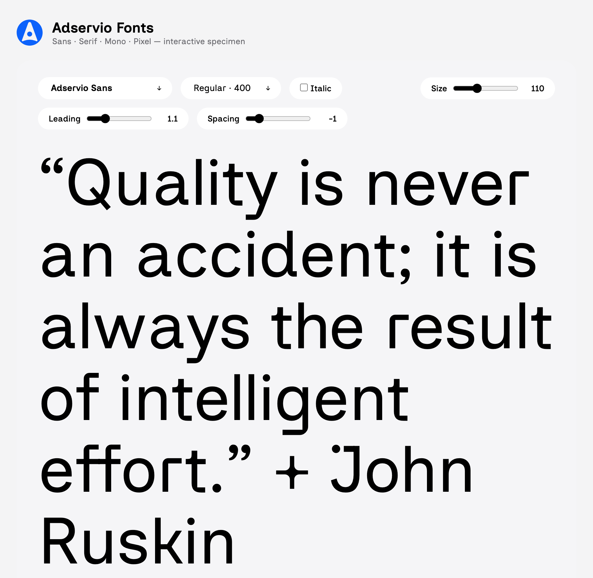
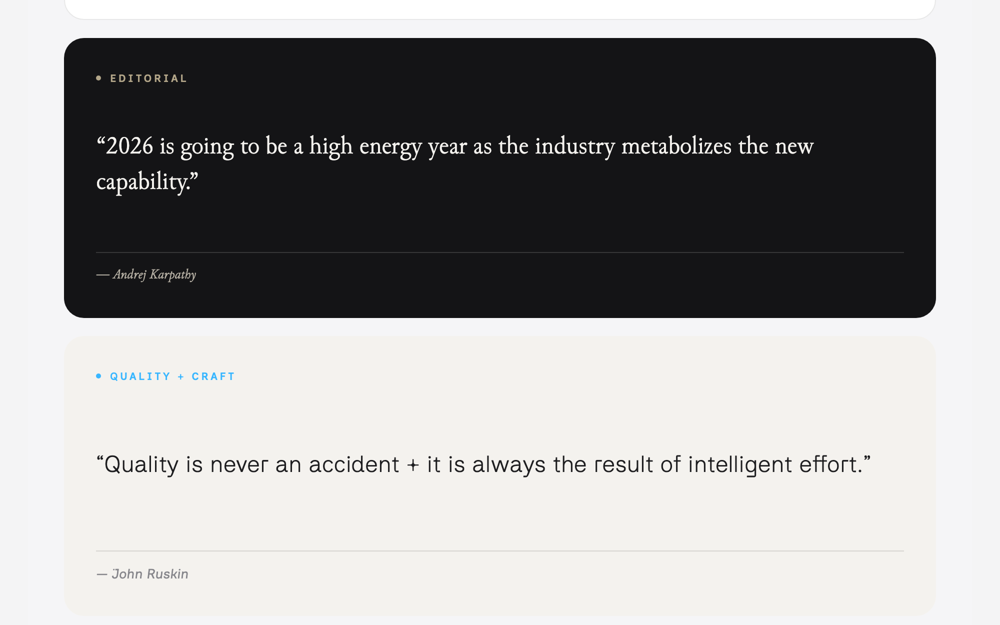
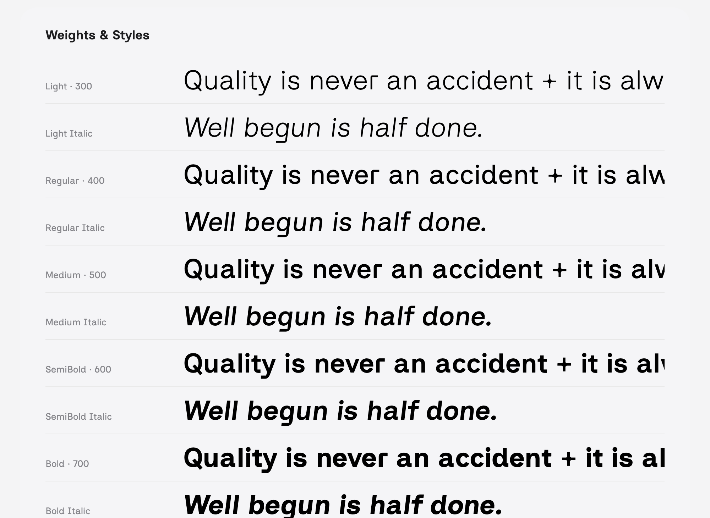
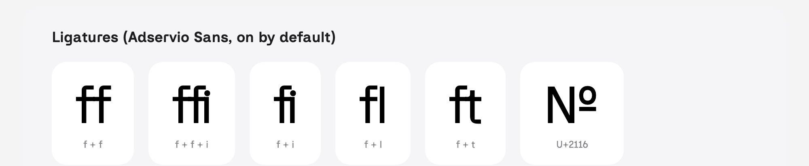
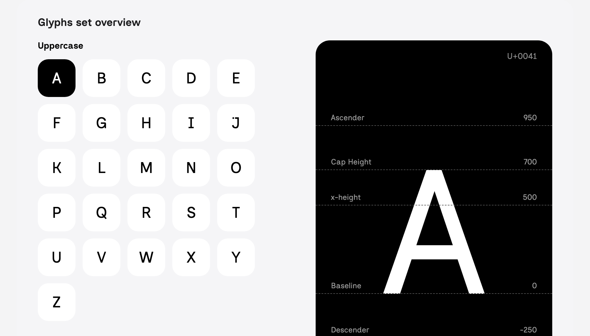
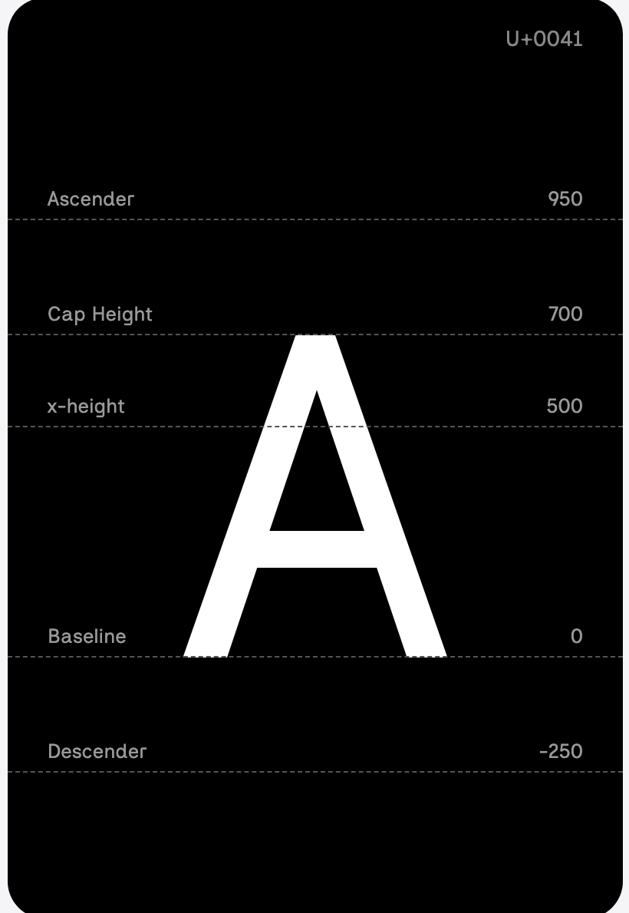

# Fonts Adservio

**Spécimen interactif : [adservio.github.io/adservio-fonts](https://adservio.github.io/adservio-fonts/)**



Quatre familles de caractères pour l'identité Adservio. Toutes sous licence SIL Open Font License 1.1 (OFL.txt dans chaque dossier).



## Familles

| Famille | Usage | Graisses | Origine |
|---|---|---|---|
| **Adservio Sans** | Texte, UI, titres | Light 300 → Bold 700, roman + italique, variable | Inclusive Sans (modifiée) |
| **Adservio Serif** | Éditorial | Light 300 → Bold 700, roman + italique, variable | Junicode |
| **Adservio Mono** | Code | Thin 100 → ExtraBold 800, roman + italique, variable | JetBrains Mono |
| **Adservio Pixel** | Display | 5 styles : Square, Circle, Grid, Line, Triangle | Geist Pixel |

## Particularités d'Adservio Sans

- « g » simple étage par défaut, pied en L à angle intérieur droit ; « a » à deux étages
- k et K géométriques : fût + barre horizontale + deux diagonales quasi égales
- f à coude serré et sommet plat ; r simple en L
- Série « extérieur arrondi / intérieur droit » : a, d, g, q, r, t, y
- Zéro sans barre, G à coin de fût arrondi, J avec barre et point
- Signe + à nœud central doux (congés intérieurs), lignes fines
- Ligatures actives par défaut : ff, ffi, fi (point détaché), fl, ft

## Nouveautés — Adservio Sans 2.015 (18 juillet 2026)

- **k / K** : nouveau dessin géométrique (fût, barre horizontale à mi-hauteur, diagonales quasi égales)
- **f** : coude supérieur serré, sommet plat, traits allongés — répercuté sur les 5 ligatures dessinées
- **g** : la variante simple étage devient le défaut ; pied horizontal long, coude adouci puis angle intérieur droit
- **y** : barre inférieure allongée, épaisseur constante (pointe non effilée)
- **q, t, d, a** : pieds et crochets refaits — extérieur arrondi, angle intérieur droit ; barre du q allongée
- **r** : bras simplifié en L (extérieur arrondi, intérieur droit)
- **fi / ffi** : point de l'i descendu (Light/Regular) ou décollé (Bold) pour ne plus toucher le crochet du f
- **+** : croix monobloc à congés intérieurs, lignes affinées, nœud central marqué en Light/Regular
- **Adservio Serif** : chiffres alignés (lining) par défaut sur toute la famille
- Spécimen : citation John Ruskin avec « + » en texte des graisses et carte « Quality + Craft »

## Contenu de chaque dossier

- `ttf/` — statiques TrueType (usage bureautique, installation système)
- `otf/` — statiques OpenType CFF (Adservio Sans uniquement)
- `variable/` — fonts variables (axe de graisse)
- `webfonts/` — WOFF2 pour le web

## Utilisation web

```css
@font-face {
  font-family: "Adservio Sans";
  src: url("AdservioSans/webfonts/AdservioSans[wght].woff2") format("woff2");
  font-weight: 300 700;
  font-style: normal;
}
@font-face {
  font-family: "Adservio Sans";
  src: url("AdservioSans/webfonts/AdservioSans-Italic[wght].woff2") format("woff2");
  font-weight: 300 700;
  font-style: italic;
}
```

## Spécimen









Version en ligne : [adservio.github.io/adservio-fonts](https://adservio.github.io/adservio-fonts/) — ou ouvrir `specimen.html` à la racine du package : testeur interactif (taille, interligne, espacement, graisses, italique), grille complète des glyphes et prévisualisation avec lignes de métriques pour les quatre familles.

## Auteur

Familles réalisées par **Anis ZOUAOUI**, en s'inspirant de superbes fonts open source.

## Remerciements

Ces familles sont des dérivées de fonts open source remarquables, que nous remercions chaleureusement :

- **[Inclusive Sans](https://github.com/LivKing/Inclusive-Sans)** d'Olivia King — base d'Adservio Sans, une linéale pensée pour la lisibilité et l'accessibilité.
- **[Junicode](https://github.com/psb1558/Junicode-font)** de Peter S. Baker — base d'Adservio Serif, une serif érudite au répertoire exceptionnel.
- **[JetBrains Mono](https://github.com/JetBrains/JetBrainsMono)** de JetBrains — base d'Adservio Mono, référence des fonts de code avec ses ligatures de programmation.
- **[Geist Pixel](https://github.com/vercel/geist-font)** de Vercel — base d'Adservio Pixel et de ses cinq trames display.

Conformément à la licence OFL, les mentions de copyright d'origine sont conservées dans les fichiers et les noms d'origine ne sont pas réutilisés. Merci à ces créatrices et créateurs de publier leur travail en open source — ce package n'existerait pas sans eux.
